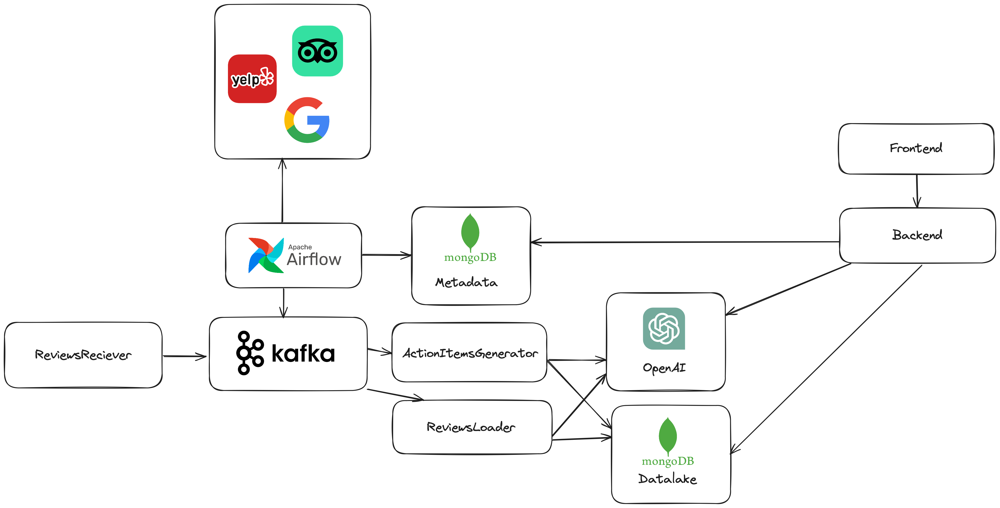

# Revisar AI

## Table of Contents

- [Description](#description)
- [Architecture](#architecture)
- [Usage](#usage)
- [Contributors](#contributors)

## Description

Revisar AI is a sophisticated system designed to analyze reviews using Artificial Intelligence. The system is built with a focus on providing users with insightful and comprehensive review analysis in a simple and convenient manner.

Leveraging a microservice architecture, the system ensures high scalability and robustness. Each component of the system is a standalone service, allowing for independent scaling and deployment, which significantly improves the overall performance and reliability of the system.

The core of Revisar AI is its AI-powered review analysis engine, which uses OpenAI's GPT-3.5 model for Natural Language Processing (NLP). This advanced AI model allows the system to understand the sentiment and context of the reviews with a high degree of accuracy.

In addition to review analysis, Revisar AI also provides action items generation and automatic reply functionalities. The system can generate actionable insights from the reviews and even craft appropriate responses using AI, further enhancing the utility of the system for businesses and individuals alike.

Whether you are a business looking to understand customer feedback, or a consumer trying to make sense of product reviews, Revisar AI provides a powerful tool to extract meaningful insights from reviews and interact with them in a more efficient way.

## Architecture



### Kafka

The Kafka broker in our system serves as a reliable communication channel between the microservices, ensuring no data or information loss. This adds a layer of reliability to the system. It has two main use cases:

1. Transporting Raw Reviews: The Kafka broker receives raw reviews from the ReviewsReciever service and transports them to the next microservice for analysis and enrichment.

2. Handling Action Items Requests: The Kafka broker also handles requests to generate action items for users, ensuring these requests are processed efficiently and reliably.

### Airflow

Airflow is our task scheduler and plays a crucial role in our ETL (Extract, Transform, Load) process. It is used for the following tasks:

1. Scheduling Action Items Generation: Airflow schedules the generation of action items requests on a daily basis for users who have opted to receive action items on the current day of the week.

2. Scheduling Reviews Fetching: Airflow also schedules tasks to fetch reviews from external websites, ensuring that our system always has the latest reviews for analysis.

### Metadata Database

The Metadata Database in our system is a MongoDB database. It is responsible for storing metadata about the clients and the API keys. This information is crucial for managing client interactions and ensuring secure access to our services.

### Datalake

The Datalake in our system is a MongoDB database that stores all the data that has been processed and enriched using AI. Unlike a traditional datalake, it does not store raw or intermediate results, but rather functions more like a data warehouse. It holds the final processed data, providing a comprehensive repository for all the information that our AI systems have processed and enriched.

### ReviewsReciever

The ReviewsReciever is a REST API that receives batches of reviews and sends them to a Kafka broker for processing and enrichment. This service is designed to handle large volumes of reviews efficiently and reliably.

Authentication with the ReviewsReciever service is based on API keys. This ensures that only authorized clients can send reviews for processing, providing an additional layer of security to the system.

### ReviewsLoader

The ReviewsLoader is a Kafka consumer that reads the raw reviews and sends them to OpenAI's ChatGPT for sentiment analysis and to determine the importance of the review. The responses from ChatGPT, which include the sentiment analysis results and the importance of the review, are then saved in the Datalake. This process allows us to enrich our review data with valuable insights from AI analysis.

### ActionItemsGenerator

The ActionItemsGenerator is a Kafka consumer that receives action items generation requests. It uses the most important reviews from the last week to generate 5 action items for each request. These action items are then saved in the Datalake. This process allows us to generate actionable insights from our review data and store them for further use.

### Backend

The Backend serves as the bridge between our data and the client. It connects to the Frontend and supplies the necessary data for displaying graphs and reviews. The Backend retrieves its data from the Datalake and the Metadata Database. In addition, it communicates with OpenAI's ChatGPT to generate automatic replies for reviews based on the client's needs. This process allows us to provide the client with access to all the processed data and to facilitate interactive and responsive client interactions.

### Frontend

The Frontend is the interface that the client interacts with. It's a React application that provides the client with access to all the insights we have generated. The Frontend displays graphs, reviews, and other data-driven insights, enabling the client to fully leverage the power of our data processing and AI enrichment.

## Usage

### Docker Compose

To run the infrastructure, we use Docker Compose. This tool allows us to define and run multi-container Docker applications.

If you want to run the infrastructure with Airflow, you need to use the `--profile airflow` option with Docker Compose.

The first time you run Airflow, it's crucial to initialize it. You can do this by running the following command:

```bash
docker compose up airflow-init
```

After initializing Airflow, you can start the infrastructure with the following command:

```bash
docker compose --profile airflow up -d
```

If you want to run the infrastructure without Airflow, you can use the command:

```bash
docker compose up -d
```

### Environment Variables

Each microservice requires certain environment variables to run properly. These are configuration values that can be changed depending on the environment in which the application is running. The following table lists the environment variables required for each microservice, along with a brief description of each:

| Microservice         | Environment Variables   | Description                            |
| -------------------- | ----------------------- | -------------------------------------- |
| ReviewsReciever      | METADATA_DB_URL         | The URL of the metadata database       |
|                      | METADATADB_NAME         | The name of the metadata database      |
|                      | PORT                    | The port on which the service runs     |
|                      | KAFKA_BROKERS           | The addresses of the Kafka brokers     |
| ActionItemsGenerator | DB_URL                  | The URL of the database                |
|                      | DB_NAME                 | The name of the database               |
|                      | PORT                    | The port on which the service runs     |
|                      | TOPIC                   | The Kafka topic to consume             |
|                      | BROKERS                 | The addresses of the Kafka brokers     |
|                      | CONSUMER_GROUP          | The Kafka consumer group               |
|                      | OPENAI_API_KEY          | The API key for OpenAI                 |
| ReviewsLoader        | (REFACTOR ENV VARS)     |                                        |
| Backend              | DATALAKE_DB_URL         | The URL of the Datalake database       |
|                      | DATALAKE_DB_NAME        | The name of the Datalake database      |
|                      | METADATA_DB_URL         | The URL of the metadata database       |
|                      | METADATA_DB_NAME        | The name of the metadata database      |
|                      | PORT                    | The port on which the service runs     |
|                      | REFRESH_TOKEN_SECRET    | The secret used to sign refresh tokens |
|                      | ACCESS_TOKEN_SECRET     | The secret used to sign access tokens  |
|                      | ACCESS_TOKEN_EXPIRATION | The expiration time for access tokens  |
|                      | GOOGLE_CLIENT_ID        | The client ID for Google OAuth         |
|                      | OPENAI_API_KEY          | The API key for OpenAI                 |
| Frontend             | VITE_GOOGLE_CLIENT_ID   | The client ID for Google OAuth         |

Please replace the placeholders with the actual values before running the microservices.

## Contributors

- [Liad Yacobi](https://github.com/liadyacobi)
- [Yoav Richter](https://github.com/yoavrichter30)
- [Shaked Abdu](https://github.com/Shaked-abdu)
- [Yair Chen](https://github.com/chenyair)
